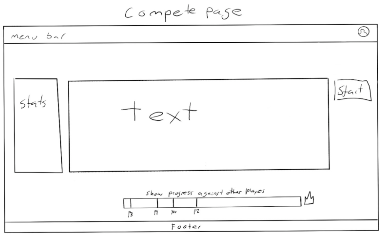

# **Project Proposal**

Dan Pomerantz, Sam Imberman

420-620-DW

* [Web Development Project Proposal](https://dawsoncollege.gitlab.io/620-capstone/2023-01/620-study/specifications/projectProposal.html#web-development-project-proposal)
    * [Identification](https://dawsoncollege.gitlab.io/620-capstone/2023-01/620-study/specifications/projectProposal.html#identification)
    * [Project summary](https://dawsoncollege.gitlab.io/620-capstone/2023-01/620-study/specifications/projectProposal.html#project-summary)
    * [User stories](https://dawsoncollege.gitlab.io/620-capstone/2023-01/620-study/specifications/projectProposal.html#user-stories)
        * [About user personas](https://dawsoncollege.gitlab.io/620-capstone/2023-01/620-study/specifications/projectProposal.html#about-user-personas)
        * [Example](https://dawsoncollege.gitlab.io/620-capstone/2023-01/620-study/specifications/projectProposal.html#example)
        * [Target user personas](https://dawsoncollege.gitlab.io/620-capstone/2023-01/620-study/specifications/projectProposal.html#target-user-personas)
        * [User persona 1](https://dawsoncollege.gitlab.io/620-capstone/2023-01/620-study/specifications/projectProposal.html#user-persona-1)
        * [User persona 2](https://dawsoncollege.gitlab.io/620-capstone/2023-01/620-study/specifications/projectProposal.html#user-persona-2)
    * [Mockups](https://dawsoncollege.gitlab.io/620-capstone/2023-01/620-study/specifications/projectProposal.html#mockups)

# **Web Development Project Proposal**

Please copy this document to final project GitLab repository (not the proof of concept repo), in a branch named `proposal`. I will give you my comments in the MR.

(read the tutorials/gitTips.md!)

## **Identification**
Student participant names:
1. Andrew
2. Christopher
3. Katharina
4. Rim
5. Mauricio

The name of your team’s software company: OasisGames

Official project name (can be changed later): Keyboard Champions

Project’s internal codename (cannot be changed later): monke

_n.b: A software project usually has a codename which is immune to the vagaries of your company’s marketing department. For example, one notorious version of Windows was internally referred to as “Longhorn” and one notorious version of Mac OS was referred to as “Rhapsody”. The latter-day tradition of naming versions of Mac OS after cats or places in California comes directly from the much older tradition of internal software codenames._

_You should give your project a codename so that you can use it inside your software; it gives you an obvious namespace, a name for a singleton object, a prefix for whatever APIs you create, and so on. It should be something fun and memorable, but be careful, because names written in code are much harder to change than names invented by the marketing department!_

## **Project summary**
In as few words as possible but without sacrificing accuracy, give a high-level summary of your project:

A customizable typing test where you can compete with your friends in real time. All users can do the solo typing test as well as creating a lobby to compete with other users. Users can login to have access to extra features such as submitting texts they want to see displayed and seeing their statistics over time (improvement). Admins have power to manage users and approve/deny text submissions. All users will have access to a leaderboard to see how they compare with others. 

The project requires you to import a large data set. What data set(s) will you need for this project? Please include specific URLs. An important thing to check is that your data set includes the necessary information for your project! You should look at the columns of it and see what is there!

The large dataset will be scraped from the website linked below before getting cleaned and stored in a database. Text samples will be randomly (or filtered through user selected criteria) retrieved from the database.

Datasample website: [https://www.gutenberg.org/] (https://www.gutenberg.org/)

What will make your website unique? For example, is there a specific feature that your website will focus on? Will you appeal to a specific set of customers? (Please note that if you don’t have any great ideas, it’s okay 😊 It’s mostly just to think about the real world aspects of your program!)

What will make our website unique from other typing tests is the user login feature that allows you to add friends and compete against them in real time along with a leaderboard. Another interesting unique feature that other typing tests don’t have is a text submission feature to see your text being used in typing races. 

## **User stories**
### **About user personas**

In order to correctly choose what features to develop and in what order, we need to think about “target user personas” for our software – in other words, to classify the types of people who would be likely to use the software in different ways. Individuals may fall into different user personas over time depending on how they are using the software at a given moment. For example, if your app were a collaborative recipe book web app, your target user personas might include:						

* recipe contributors, who want to write recipe profiles and put them on the site, and therefore need good recipe editing tools;
* recipe browsers, who are looking for a recipe to cook, and therefore need an excellent browsing and search system;
* people currently using the app while cooking, who may need a customized view of a recipe that they can put on a tablet propped up in the kitchen;
* recipe moderators, whose role is to do quality verification for the recipes, make sure that all sections of recipes are filled in, remove inappropriate language, and so on;
* … and perhaps other categories?

Note that the same individual may be a “recipe browser” at some times and a “recipe contributor” at others.

Developing user personas for your own project will help you tailor your features to particular people, and to prioritize between features.

When we have figured out our target user personas, we write “use cases” describing how our target user personas are likely to interact with our software.

### **Example**
---
Persona description: Recipe browser

Name: Bert

Importance of users corresponding to this profile: Very important! 90% or more of people

Broad goal: To find something to cook
How the software satisfies the needs of this user profile:

* User story \
_Feature provided for the use case_
* As a recipe browser, I want to find a dish that I wish to cook (e.g. “steak au poivre”) \
_A search box somewhere on top \
A profile history of recently visited recipes_
* As a recipe browser, I wish to save recipes I like in order to find them again later \
_A “recipe book” \
The ability to star individual recipes_
* As a recipe browser, I wish to explore the available recipes to find something interesting to cook \
_A “most recent recipes” view \
A “search by ingredient” page?_

---

### **Target user personas**

Please copy and paste the below “user persona” section as many times as necessary. There must be at least 2; there are likely to be 3 or more. Note that “administrators” and so on are users too. You may change these personas later if you need to.

---

### **User persona 1**

Persona description: typing enthusiasts (wants to get faster)

Name: Mykyta (teen-young adult)

Importance of users corresponding to this persona: 80% of the users

Broad goal: wants to be better at typing (faster and less mistakes)

User stories (give at least 2):
1. _Uses a computer daily and finds that their typing ability does not match their thinking speed. They want to be able to type as fast as they think_
    - ability to display the stats related to their typing
    - display a variety of texts at random in order to practice on different types of texts
2. _Wants to have a sense of competition between friends and show their improvement._
    - multiplayer functionality
    - ability to see opponents progress compared to yours
    - leaderboard
    - ability to log in
    - retrieve and store past results and text used
    - ability to launch game from profile
---
### **User persona 2**

Persona description: Office clerk

Name: Sylvie (usually 35+ years old)

Importance of users corresponding to this persona: 15% of the users (not as big but still important, low percentage due to the usual old age of the persona)

Broad goal: she wants to type faster to keep up with the typing speeds required by her job.

User stories (give at least 2):
1. _Her boss started hiring more people at the office company. She feels that she has to keep up or she risks missing on the promotions she deserves 🙏_
    - Ability to select the difficulty of the text by choosing what kind of characters to have in the text
    - ability to choose the language of the text that is more suitable to the user
2. _She always wanted to learn how to type without looking at the keyboard. She wants to improve_
    - have a section with links on articles about how to get better
    - ability to play as many time as the user want, with ability to track progress
---

**User persona 3**

Persona description: Casual User

Name: Bob

Importance of users corresponding to this persona: 5% of the users 

Broad goal: He likes to write and would want to submit his texts and see them show up

User stories (give at least 2):
1. _Bob wants to see his texts show up on the website for others to type while playing_
    - ability to log in
    - submit your own text functionality
    - admin review process for texts to make sure the texts are appropriate
2. _Bob is curious about what he previously submitted, wants to be able to view remove the texts_
    - ability to login
    - store previously sent texts
    - display of user's text submission along with their status
    - delete previously sent text submission

**User persona 4**

Persona description: Avid User

Name: MasterTyperXX (Tom)

Importance of users corresponding to this persona: 30% of the users 

Broad goal: He wants to be the best, he wants to reach the first place in the leaderboards. He wants to win every match he plays online.

User stories (give at least 2):
1. _Tom wants to see that he is doing better than other competitors in an online lobby_
    - join online lobby and play
    - ability to see other competitors' progress during the game
    - see stats of other players at the end of a multiplayer match
    - while waiting for others to finish you could send message in the lobby
    - taunt other players
2. _Tom wants to see he's ranking in the leaderboard and see other people's profile to compare_
    - ability to go on the leaderboard
    - look at another user's profile
    - able to see other profiles from the leaderboard
    - search up other users and see their profile

**User persona 5**

Persona description: Casual User

Name: Frank

Importance of users corresponding to this persona: 20% of the users 

Broad goal: When he is bored or waiting in lobby for other games he comes and practice typing

User stories (give at least 2):
1. _Frank wants to multi-task or play two games at the same time_
    - while waiting in other game lobby's, he can come to the website and play
    - playing a game is fast and easy, does not require much setup
    - text to speech is an option, so he can be on another tab/window and still know the quote
2. _Frank does not want to spend too much time playing games_
    - ability to switch game settings
    - cookie preference so he does not have to setup everytime he plays

---

## **Mockups**

Insert one or more sketches/mockups of your project’s user interfaces here. After each mockup, write a list of which features from the table above are shown in each mockup and where they are represented. (You may also draw that directly on the mockup, with arrows.)

Please produce as many mockups as necessary to show as much of your application as possible.

n.b: If you submit a photo using a phone/tablet camera, please ensure it is as legible/clear as possible by taking the photo in good lighting and by positioning the camera directly above. Alternatively, you can use a scanner, or make your sketches in a mockup or vector drawing program such as Pencil or Figma.

---
Main UI:

List of features presented:
* Typing option to fine tune game
    * Text length
    * Punctuation
    * Numbers
    * Etc.
* Restart button 
* Game area(text)
    * Displays text to be typed
* Nav bar (on all pages)
    * Leaderboard (popup window)
    * Create (creates a lobby, popup window)
    * Join (join a lobby with code?, popup window)
    * User icon
        * Not logged in
            * Bring you to login/register page(or popup)
        * Logged in
            * Displays a drop down menu
                * Profile(go to profile page)
                * Logout
                * Settings(TBD)
                * Friends list(TBD)
---
Compete UI:

List of features presented:
* Game area(text)
* Stats display
    * Timer
    * Words per minute
    * Accuracy
    * Etc.
* Start button (shown to lobby creator only)
* Progress bar to display each player’s progress
* Quotes/text choosen will be random
* Can join/create lobbys from here (lobbys are created and deleted as needed)
---
Browse and Details page UI:

List of features presented:
* List of books/quotes/texts used in the type racer
* Detailed description provided when clicking on the particular item
    * Text
    * Date added
    * Category or Origin
* Filter functionality (filter by category/origin)
* Sort functionality
* Search functionality (searches the text and origin)
* Cannot choose specific quotes to write (submitted quotes will be added to the pool)
* Stats are not tied to specific text

User/profile page:

List of features presented:
* Profile picture (will be changeable)
* Users name
* Users rank
* User stats
    * Avg. words per minute
    * Avg. typing speed (time)
    * Accuracy
    * Total hours/minutes typed
    * Wins/Losses in type races

Login/register page (can make popup box instead):
 

List of features presented:
* Register (Create a new account)
* Login

Submit Quote UI:

List of features presented:
* Enter quote
* Enter quote origin(what movie, game, book)
* Submit(will then be put on pending until approved/rejected by an admin)

Last update: 2023-01-18 18:10:12 +0000 (Jaya - 522fb9d)

Source: /620-study/specifications/projectProposal.md
